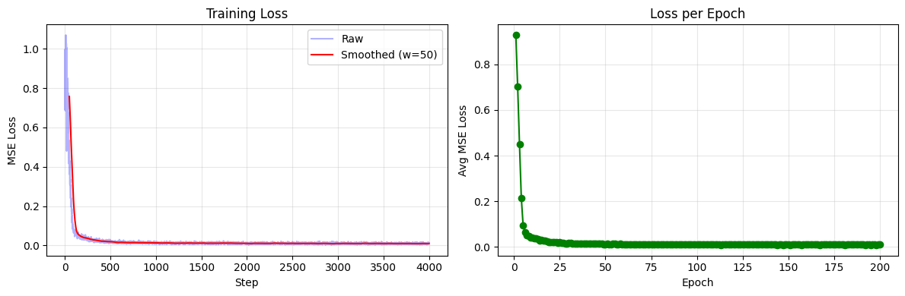
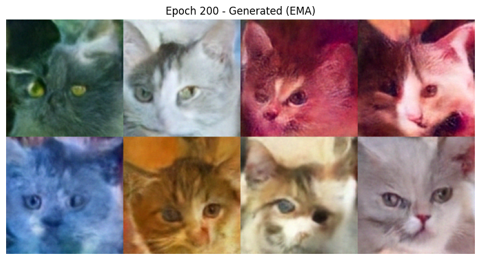
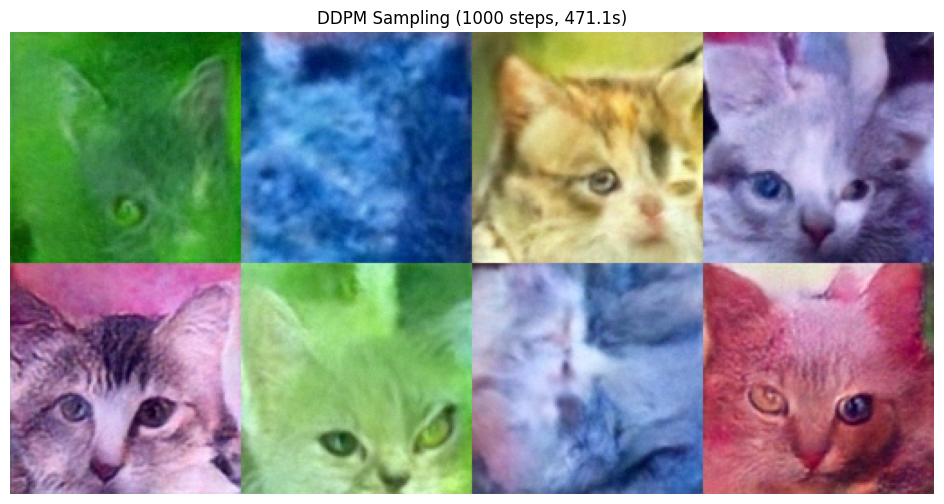
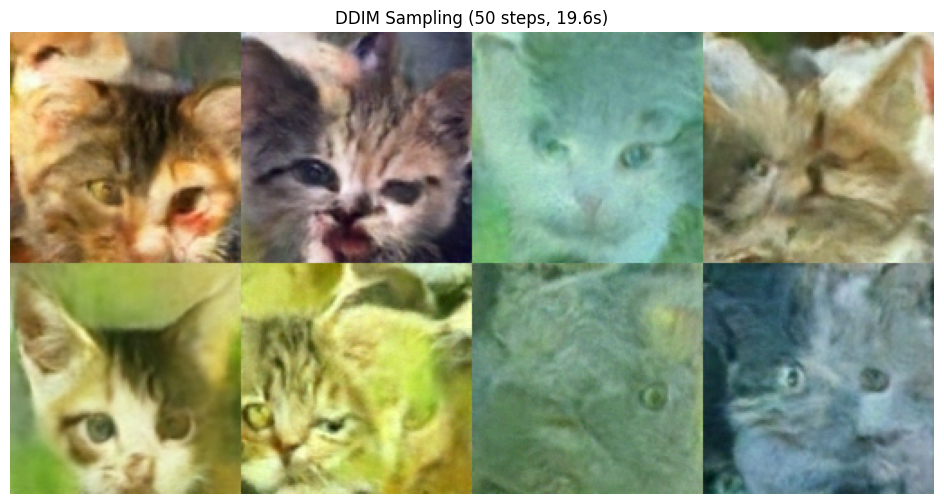

# Обучение диффузионной модели (DDPM/DDIM) на датасете котов

Диффузионная модель для генерации изображений котов, обученная на датасете [huggan/few-shot-cat](https://huggingface.co/datasets/huggan/few-shot-cat) (160 изображений). Вся работа — обучение, сэмплинг, эксперименты — выполняется в одном Jupyter Notebook (`diffusion_hw.ipynb`).

## Архитектура

Модель — UNet2D с 6 уровнями и каналами (128, 128, 256, 256, 512, 512). На уровнях 256ch и 512ch стоят attention-блоки (AttnDownBlock2D / AttnUpBlock2D), что позволяет модели улавливать глобальную структуру на двух масштабах — форму тела кота и расположение морды. Шумовой процесс — DDPM с 1000 timestep'ами и cosine-расписанием (squaredcos_cap_v2), модель предсказывает шум (epsilon-prediction).

## Установка и запуск

```bash
python3 -m venv venv
source venv/bin/activate
pip install -r requirements.txt
jupyter notebook diffusion_hw.ipynb
```

Запустить все ячейки последовательно. Обучение занимает ~2-3 часа на Apple Silicon (MPS).

## Параметры обучения

- Разрешение: 128x128
- Batch size: 8 (20 шагов на эпоху)
- 200 эпох = 4000 optimizer steps
- Learning rate: 1e-4, cosine schedule с 500 warmup steps
- EMA decay: 0.999 (half-life ~693 steps)
- Min-SNR loss weighting (gamma=5.0)
- Gradient clipping: 1.0
- Аугментация: RandomCrop, RandomHorizontalFlip, ColorJitter

## Результаты обучения

Лучший чекпоинт — epoch 198, loss 0.0084. Loss стабилизировался к эпохе ~60 и далее колебался в диапазоне 0.009-0.012





## Сэмплинг

### DDPM (1000 шагов)



### DDIM (50 шагов)



### Сравнение DDPM и DDIM

| Метод | Шаги | Среднее время (8 изобр.) | Ускорение |
|---|---|---|---|
| DDPM | 1000 | 379.9 с | 1.0x |
| DDIM | 50 | 18.5 с | 20.5x |

DDIM быстрее в 20.5 раз при сопоставимом качестве: стохастический DDPM даёт больше разнообразия, детерминированный DDIM стабильные результаты за 50 шагов.

## Эксперименты

### Влияние количества шагов DDIM

| Шаги | Время (с) |
|---|---|
| 10 | 1.3 |
| 25 | 2.4 |
| 50 | 4.8 |
| 100 | 9.6 |
| 200 | 19.3 |
| 500 | 48.3 |

Время растёт линейно. 50 шагов — оптимальный баланс качества и скорости.

### Влияние noise schedule

Все три расписания (linear, scaled_linear, squaredcos_cap_v2) работают с DDIM. Модель обучалась на squaredcos_cap_v2 — при сэмплинге с этим расписанием результаты лучше, так как alpha-значения совпадают с тем, чему модель училась.
## Ключевые решения

- Min-SNR loss weighting предотвращает доминирование шумных timestep в loss  модель лучше выучивает детали на низких t
- Attention на двух уровнях вместо одного
- squaredcos_cap_v2 вместо linear дает более плавное зашумление
- beta_schedule при сэмплинге должен совпадать с обучением, иначе alpha-значения не совпадают и генерация портится

## Демо

[_Ссылка на видео](https://cloud.mail.ru/public/pWAd/Cto6JPizE)
